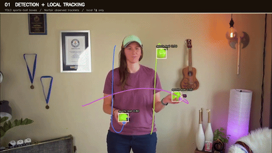
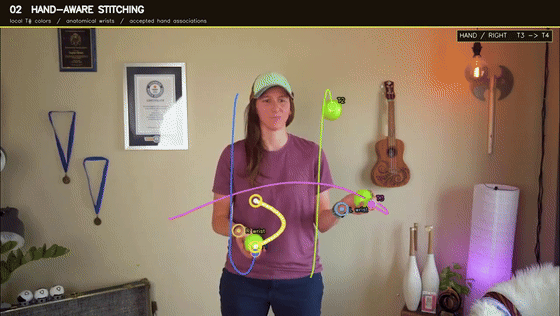
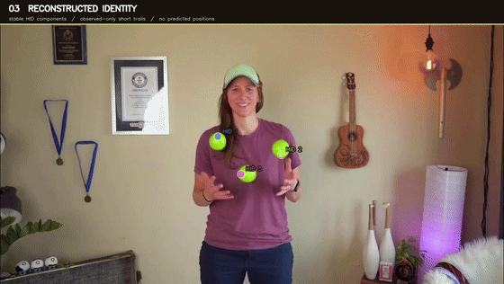

# Juggling Ball Identity Tracking

Recovering ball identities when juggling detections disappear during catches and occlusions.

YOLO finds balls frame by frame. Norfair follows them locally. This project adds hand-aware reasoning to reconnect track fragments that belong to the same ball.

**Python · YOLO · Norfair · Pose estimation · Multi-object tracking**

[How it works](#how-it-works) · [Run it](#run-the-frozen-demo) · [Code guide](scripts/README.md) · [Snapshot details](docs/DEMO.md)

## Demo: one clip, three stages

These previews show the **same four seconds**, with different overlays. Click any preview for the full-quality, 18-second MP4. GitHub plays the GIFs independently; their source frames match, but browser playback is not synchronized.

### 1. Detection and local tracking

[](docs/assets/demo-local-tracking.mp4)

Boxes show YOLO detections. Colors and `T#` labels show Norfair's local tracklets. Watch a track end at the hand and a new ID appear: a detector gap can split one physical ball into several local identities.

### 2. Hand-aware identity stitching

[](docs/assets/demo-hand-stitching.mp4)

Wrist markers provide context for the track boundaries. Near the end of the preview, the yellow bridges show accepted links such as `T1 → T5` and `T4 → T6`.

**Dashed bridge = identity association, not estimated trajectory.** A pending-hand token records an identity associated with a hand; it does not locate an invisible ball.

### 3. Reconstructed identity

[](docs/assets/demo-reconstructed-identity.mp4)

Linked fragments share a color and `HID#`. For example, `T1 → T5 → T10` shares one reconstructed identity across the full clip. The preview shows the first of those repairs; the MP4 shows the longer sequence.

The frozen clip contains **14 local tracklets, 6 accepted hand links, and 8 reconstructed identity groups**. These are artifact counts, not an accuracy score: unresolved fragments remain, and HID is not guaranteed ground truth.

## How it works

```text
Video → YOLO detections → Norfair local tracklets
                              ↓
Pose / wrists ────────→ START / END boundaries
                              ↓
                     Hand entry / exit events
                              ↓
                     Pending-hand association
                              ↓
                     Reconstructed identities
```

Track endings near and approaching a wrist are candidate hand entries. New tracks near and separating from a wrist are candidate exits. A hand-state machine associates compatible events; connected tracklets then share an HID.

```text
normalized hand distance = distance(ball, wrist) / body scale

Local identities:       T1 ─── gap ─── T5 ─── gap ─── T10
Reconstructed identity:               HID1
```

The hand layer uses the hand interaction rather than assuming a ballistic path through a catch. The renderer retains observed trails and draws association bridges separately.

## Run the frozen demo

This is a fixed demonstration checkpoint while the broader project continues. The media, canonical CSVs, and matching hand-repair implementation are preserved together. No webcam is required.

- **Watch:** use the previews above or open the linked MP4s.
- **Reproduce the hand decisions:** follow [hand-repair reproduction](docs/HAND_REPRODUCTION.md). It uses committed tracklet and pose CSVs without detector inference or source footage.
- **Render the videos:** see [demo inputs and rendering](docs/DEMO.md). This requires the original local clip.
- **Install dependencies:** see [setup](docs/SETUP.md).

Reproduce and check the frozen hand decisions without inference or video:

```bash
.venv/bin/python scripts/reproduce_demo_hand.py --output-dir "$(mktemp -d)"
```

To recreate only the GIF previews from the committed MP4s:

```bash
.venv/bin/python scripts/render_demo_videos.py --gif-only
```

Run tests from the repository root:

```bash
.venv/bin/python -m pytest -q
```

## Read the code

| Location | Purpose |
| --- | --- |
| [scripts/](scripts/README.md) | Detection, tracking, hand repair, and rendering entry points |
| [tests/](tests/) | Pipeline contracts and frozen-demo regression tests |
| [detections/demo/](detections/demo/) | Canonical detector, tracklet, and hand-repair artifacts |
| [docs/](docs/README.md) | Setup, reproduction, and media documentation |
| [archive/](archive/README.md) | Historical experiments and negative results; not the demo pipeline |

The [code guide](scripts/README.md) separates the current demo path from older review tools. Historical experiments remain available, but are not prerequisites for the demo.

## Scope and next steps

The snapshot covers offline detection, local tracking, wrist extraction, hand-boundary reasoning, pending-hand state, and reconstructed identity visualization. False detections, ambiguous catches, and unresolved fragments remain limitations. The demo is illustrative, not a benchmark of general tracking accuracy.

Further work is separate from this checkpoint:

- Airborne repair using ballistic consistency.
- Body-occlusion reasoning.
- Throw/catch event extraction and siteswap inference.
- Juggling Markup Language (JML) encoding for machine-readable patterns.

A separate live-webcam prototype is a development path, not part of this demo.
