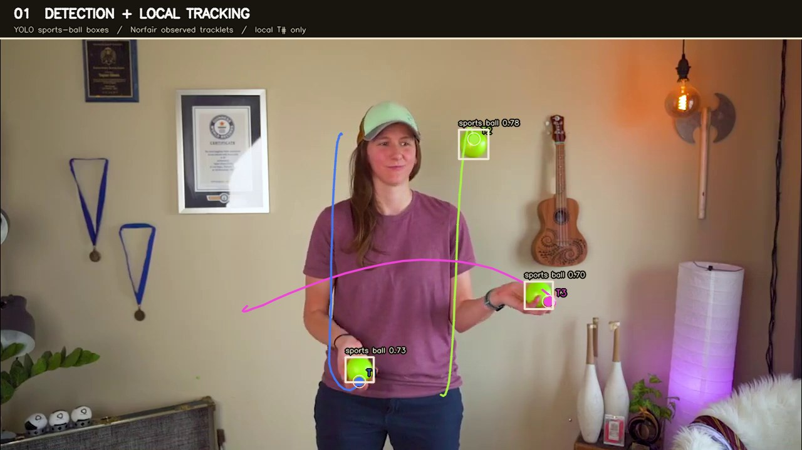
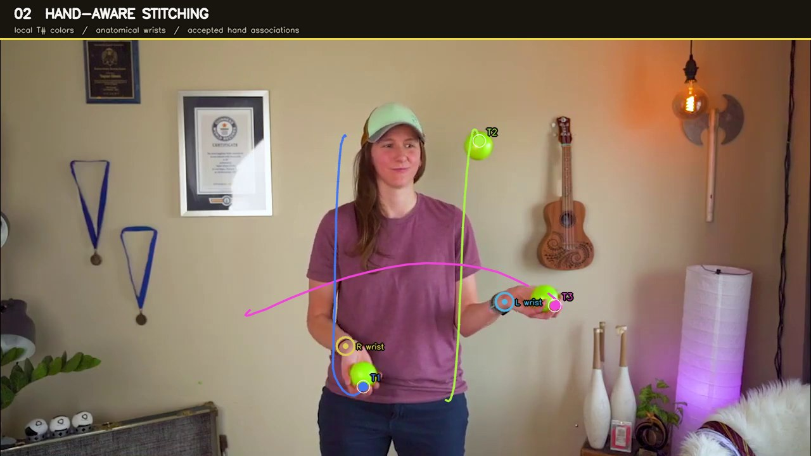

# Juggling Ball Identity Tracking

Detecting, tracking, and reconstructing persistent ball identities from ordinary juggling video.

A frame-by-frame detector can find a juggling ball, and a short-term tracker can follow it for a while. The harder problem is preserving **which physical ball is which** when detections disappear during catches, hand occlusions, motion blur, or other short gaps.

This project builds a computer-vision pipeline that starts with YOLO detections and Norfair tracklets, reasons about track boundaries near the juggler's hands, and reconnects compatible fragments into longer-lived reconstructed identities.

**Python · YOLO · Norfair · Pose Estimation · Multi-Object Tracking · Temporal Reasoning**

## Demo: from detections to persistent identity

The three videos below use the **same juggling clip with the same timing**. Each stage adds another layer of reasoning so the effect of the identity-repair pipeline can be compared directly.

### 1. Detection and local tracking

[](docs/assets/demo-local-tracking.mp4)

YOLO detects the balls frame by frame, while Norfair groups those detections into local tracklets (`T#`). These IDs are intentionally local: when a ball disappears during a catch or detector dropout, the same physical ball can later return under a different track ID.

This is the fragmentation problem the rest of the pipeline tries to repair.

**Overlay:** YOLO detections · Norfair track IDs · observed track trails

### 2. Hand-aware identity stitching

[](docs/assets/demo-hand-stitching.mp4)

Track START and END boundaries are compared with anatomical wrist position and relative motion. A track that disappears into a hand can remain pending until a compatible track emerges from that hand.

The **thick dashed curved bridges** show accepted identity associations between local tracklets.

*The dashed bridge represents an identity association, not an estimated physical trajectory through the hand.*

**Overlay:** Norfair tracklets · wrists · pending hand state · accepted hand stitches

### 3. Reconstructed identity

[](docs/assets/demo-reconstructed-identity.mp4)

Accepted hand-mediated associations connect fragmented local tracklets into longer-lived reconstructed identities (`HID#`). Local track IDs may change, while the displayed HID and color persist across repaired hand occlusions.

`HID` is the current reconstructed identity under the implemented repair system; it should not be interpreted as ground-truth identity in every possible failure case.

**Overlay:** reconstructed HID · persistent identity color · clean observed trails

## Why identity repair?

One physical ball may appear to the tracker as:

```text
T1 ──────────┐
             │ hand / detection gap
             └──── T5 ──────────┐
                                │ another gap
                                └──── T10

After identity repair:

T1 → T5 → T10
      ↓
     HID1
```

YOLO answers “is there a ball here?” and Norfair provides useful short-term continuity. The identity-repair layer addresses a different question: **do two separated tracklets represent the same physical ball?**

## Pipeline

```text
Video
  ↓
YOLO ball detections
  ↓
Norfair local tracklets (T#)
  ↓
Observed START / END boundaries
  ↓
Cause reasoning
  ├── hand interaction
  ├── airborne gap        [next]
  └── body occlusion      [planned]
  ↓
Tracklet associations
  ↓
Reconstructed identities (HID#)
  ↓
Persistent trajectories / juggling events
```

The current clean identity-repair path focuses on **hand-mediated fragmentation**. Ball-track boundaries are evaluated against pose-derived wrist locations, normalized body scale, and local motion. Compatible hand-entry and hand-exit events are associated by a small state machine, after which connected tracklets share a reconstructed HID.

## Hand-aware identity repair

```text
ball approaches wrist
        ↓
    HAND_ENTRY
        ↓
identity remains pending
       in hand
        ↓
     HAND_EXIT
        ↓
 same HID continues
```

A useful geometric feature is the ball-to-hand distance normalized by body scale:

$$
d_{\text{hand}}(t)
=
\frac{\|p_{\text{ball}}(t)-p_{\text{wrist}}(t)\|}
{\text{body scale}}
$$

Track endings near and approaching a wrist become candidate hand entries. New tracklets near and separating from a wrist become candidate hand exits. Hand associations deliberately do **not** require a ballistic trajectory while the ball is hidden in a hand.

## Current status

### Implemented

- YOLO sports-ball detection
- Norfair local center-point tracking
- observed vs. predicted tracker-state separation
- pose / anatomical wrist extraction
- START and END boundary reasoning
- hand-entry and hand-exit classification
- pending hand-identity state
- hand-mediated tracklet association
- reconstructed HID visualization
- reproducible diagnostic/demo rendering

### Experimental / planned

- airborne identity repair with ballistic motion
- explicit body-occlusion reasoning
- detector adaptation for difficult near-hand frames
- live webcam tracking interface

## Next steps

```text
persistent ball identities
          ↓
throw / catch event extraction
          ↓
siteswap inference
          ↓
JML encoding
          ↓
machine-readable juggling patterns
```

### Airborne identity repair

Reconnect tracklets interrupted away from the hands using motion and ballistic consistency, while keeping hand-mediated and airborne evidence conceptually separate.

### Body occlusion

Recognize disappearances and reappearances caused by the juggler's body instead of forcing them into hand or airborne explanations.

### Siteswap inference

Use reconstructed trajectories and throw/catch events to infer siteswap structure from video.

### JML encoding

Encode inferred juggling sequences in Juggling Markup Language (JML), providing a machine-readable representation that can be consumed by compatible juggling software and later analysis tools.

### Live analysis

A browser-based live webcam interface has been prototyped, but offline correctness and identity reconstruction remain the current priority.

## Repository layout

- `scripts/` — runnable detection, tracking, review, analysis, reconstruction, and demo-rendering tools
- `configs/` — ByteTrack and BoT-SORT configurations
- `tests/` — unit and CLI smoke tests
- `detections/` — reproducible CSV/JSON/Markdown research inputs and results
- `experiments/overnight/` — experiment code, reports, and compact result artifacts
- `videos/` — local input videos (ignored by Git)
- `outputs/` — generated videos and review clips (ignored except compact manifests)
- `docs/assets/` — site-era poster images and browser-ready comparison videos used by the README demos

Model weights, source videos, caches, and generated MP4 files outside `docs/assets/` are intentionally not versioned.

## Setup

Python 3.14 was used for the current environment. Create a virtual environment and install a PyTorch build appropriate for your machine. For the CUDA 13.0 setup used during development:

```bash
python3 -m venv .venv
.venv/bin/python -m pip install --upgrade pip setuptools wheel
.venv/bin/python -m pip install torch torchvision \
  --index-url https://download.pytorch.org/whl/cu130
.venv/bin/python -m pip install -r requirements.txt
```

CPU-only and other CUDA installations should use the matching command from the [PyTorch installation guide](https://pytorch.org/get-started/locally/) before installing `requirements.txt`.

Place input clips in `videos/`. The examples below use:

- `videos/identical_balls_trick_000_018.mp4`
- `videos/youtube_juggling_for_data_analysis_eh1I3SlZn48_075_090.mp4`

## Quick start

### Detect sports balls

COCO class 32 is `sports ball`:

```bash
.venv/bin/python scripts/detect_video.py \
  videos/identical_balls_trick_000_018.mp4 \
  --model yolo26s.pt --conf 0.15 --imgsz 960 \
  --classes 32 --device auto
```

`--device auto` selects GPU 0 when CUDA is available and otherwise uses CPU. Detection CSVs contain frame/time, class, confidence, bounding-box, center, width, and height values in original-video pixels.

### Compare generic trackers

```bash
.venv/bin/python scripts/track_video.py \
  videos/identical_balls_trick_000_018.mp4 \
  --model yolo26s.pt --conf 0.15 --imgsz 960 --classes 32 \
  --tracker configs/bytetrack.yaml --tracker-label bytetrack --device auto
```

Use `configs/botsort.yaml` or `configs/botsort_reid.yaml` for the other baselines. Their IDs are local tracklets, not guaranteed permanent ball identities.

### Build Norfair tracklets

```bash
.venv/bin/python scripts/track_norfair.py \
  videos/identical_balls_trick_000_018.mp4 \
  detections/identical_balls_trick_000_018_yolo26s_classes-32.csv \
  --distance-threshold 50 --hit-counter-max 5
```

The output distinguishes observed detector matches from predicted Norfair states. Downstream experiments use observed points when fitting trajectories.

### Rank and review candidate stitches

```bash
.venv/bin/python scripts/stitch_tracklets.py \
  videos/identical_balls_trick_000_018.mp4 \
  detections/identical_balls_trick_000_018_norfair_dt50_hc5.csv \
  --max-gap-frames 10

.venv/bin/python scripts/review_stitches.py prepare \
  videos/identical_balls_trick_000_018.mp4 \
  detections/identical_balls_trick_000_018_norfair_dt50_hc5.csv \
  detections/identical_balls_trick_000_018_norfair_dt50_hc5_stitches.csv

.venv/bin/python scripts/review_stitches.py review \
  detections/stitch_review_labels.csv
```

The review player loops the current clip until a decision is made. Controls are `c` (correct), `w` (wrong), `u` (unclear), `s` (skip), and `q` (quit). Existing labels are preserved when review assets are regenerated.

### Analyze reviewed hypotheses

Generate pose detections, then enrich the reviewed labels:

```bash
.venv/bin/python scripts/analyze_stitch_features.py pose \
  videos/identical_balls_trick_000_018.mp4 \
  --model yolo26s-pose.pt

.venv/bin/python scripts/analyze_stitch_features.py enrich \
  detections/stitch_review_labels.csv \
  --output-csv detections/stitch_review_features.csv \
  --summary-json detections/stitch_review_feature_summary.json
```

The trajectory model is `x=a+b*t`, `y=c+d*t+e*t²`. These features are descriptive and do not automatically alter tracklets or acceptance thresholds.

Every executable in `scripts/` also locates the project `.venv` when run directly. Use `--help` on any command for its complete argument list.

## Tests

```bash
.venv/bin/python -m pytest -q
```

The test suite covers CSV contracts, observed/predicted semantics, stitch ranking, review-state behavior, feature analysis, tracker configuration, direct CLI execution, and demo-renderer invariants.

## Demo assets

The three comparison videos above are generated reproducibly from the canonical clip:

```bash
.venv/bin/python scripts/render_demo_videos.py
```

The renderer uses the existing detector, tracklet, pose, event, and association artifacts. It does not run inference. The site-era assets remain under `docs/assets/`, but the GitHub README is the primary project presentation.

The renderer accepts `--video`, `--detections`, `--tracklets`, `--pose`, `--associations`, `--events`, `--state-trace`, and `--output-dir` overrides, making it straightforward to replace the canonical clip and its matching processed artifacts later.

## Research history

Earlier experiments explored ballistic wide-gap stitching, global one-to-one assignment, alternative motion models, detector headroom, and hand-state heuristics. Positive and negative results are intentionally preserved so failed approaches are not repeatedly rediscovered.

See [`experiments/overnight/RESULTS_LOG.md`](experiments/overnight/RESULTS_LOG.md) for the detailed experiment record.

## Scope and limitations

- The repository currently targets offline analysis of short juggling clips.
- COCO sports-ball detections include false positives and often weaken near hands.
- Tracklet stitching proposes or renders associations; it does not establish physical ball identity as ground truth.
- The current HID is a reconstructed identity under the implemented hand-repair subsystem, not a universal guarantee across every failure case.
- Airborne repair, body-occlusion reasoning, siteswap inference, and JML encoding are not complete.
- The experiment reports include negative results intentionally so failed approaches are not repeated.
